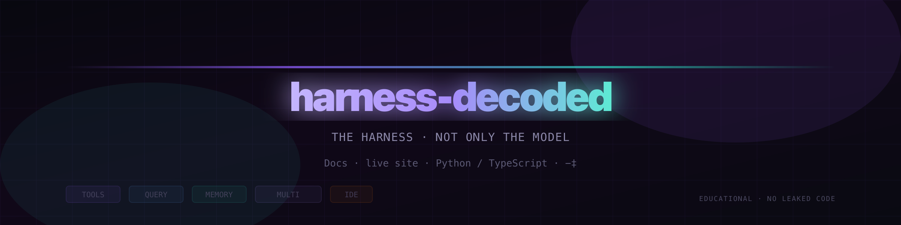

<!-- 横幅：PNG + 仓库相对路径；GitHub README 经 camo 代理时常无法显示来自 raw 的复杂 SVG。矢量源：.github/readme-banner.svg -->
<div align="center">
  <br />
  <a href="https://seanyoungw.github.io/harness-decoded/">
    
  </a>
  <br /><br />
</div>

<p align="center"><a href="README.md">English</a> · <b>简体中文</b></p>

### 解读 **Claude Code 式** harness 架构 — 文档、动画与可运行示例

**源码泄漏让我们看清一点：大部分工程量在模型周围的执行框架里，而不是单次 LLM 调用本身。**

<div align="center">
  <p>
    <a href="https://seanyoungw.github.io/harness-decoded/"></a>
    <a href="https://github.com/seanyoungw/harness-decoded/actions/workflows/ci.yml"></a>
    <a href="https://opensource.org/licenses/MIT"></a>
    <a href="https://github.com/seanyoungw/harness-decoded/stargazers"></a>
    <a href="CONTRIBUTING.md"></a>
  </p>
  <p>
    <a href="https://python.org"></a>
    <a href="https://typescriptlang.org"></a>
    <a href="https://github.com/anthropics/claude-code"></a>
  </p>
  <p>
    <b><a href="https://seanyoungw.github.io/harness-decoded/">在线站点</a></b>
    · <b><a href="docs/zh/README.md">中文文档索引</a></b>
    · <b><a href="docs/zh/00-code-map.md">代码地图</a></b>
    · <b><a href="docs/zh/methodology.md">方法论</a></b>
    · <b><a href="examples/">示例代码</a></b>
  </p>
  <br />
</div>

---

## 什么是 Harness？

多数开发者写 AI 代理时做的是 **wrapper** —— 一层薄壳：拼 prompt、解析回复。Claude Code 不是 wrapper，而是 **harness**：生产级执行框架，LLM 只是其中一环。

```
Wrapper:   用户输入 → [LLM] → 输出
Harness:   用户输入 → 工具系统 → 查询引擎 → 内存 → [LLM] → 编排器 → 输出
                            ↑         ↑         ↑              ↑
                       权限门控    背压与重试   压缩与回忆    多智能体 fan-out
```

本仓库从可视化、原理与可运行代码三个维度拆解这套架构。

---

## 三种使用方式

| 路线 | 你想… | 从这里开始 |
|------|--------|------------|
| **理解** | 对照讨论与文档，理解设计取舍 | [`docs/zh/01-architecture.md`](docs/zh/01-architecture.md) |
| **掌握** | 内化 Harness 模式，用到自己的系统 | [`docs/zh/02-harness-vs-wrapper.md`](docs/zh/02-harness-vs-wrapper.md) |
| **动手** | 从零搭生产级代理 | [`examples/`](examples/) → [`docs/zh/07-build-guide.md`](docs/zh/07-build-guide.md) |
| **英文主线** | 与英文文档、徽章页保持一致 | [`README.md`](README.md) · [`docs/README-zh.md`](docs/README-zh.md) |

---

## 学习路径（文档 ↔ 代码 ↔ 动效）

1. 浏览 [`docs/zh/00-code-map.md`](docs/zh/00-code-map.md) — 各节对应 Python/TS 文件与网站页面。  
2. 阅读 [`docs/zh/methodology.md`](docs/zh/methodology.md) — 哪些是重构叙述、哪些是公开讨论。  
3. 选做：[`docs/zh/exercises.md`](docs/zh/exercises.md)、[`docs/zh/anti-patterns.md`](docs/zh/anti-patterns.md)、[`docs/zh/decision-tree.md`](docs/zh/decision-tree.md)。  
4. 打开 [`website/principles.html`](website/principles.html) 看循环、权限门、压缩、fan-out **动画**（无需 API Key）。

---

## 交互式架构站点

最快建立整体图景的方式是看图。浏览器直接打开 [`website/index.html`](website/index.html) 即可，无需构建。

**本地预览：** `cd website && npm start`，访问 **http://127.0.0.1:5173/**（请用 **HTTP**）。若提示无效响应，多半是用了 **https://**，改成 **http://**。也可：`cd website && npm run start:py`（同端口，仅 Python）。

**重点页面：**
- **[原理动画](website/principles.html)** — 代理循环、权限门、压缩、fan-out（教学向，与示例代码对应）
- **[压缩实验台](website/compaction.html)** — 滑块与约 85% 阈值
- **[请求生命周期](website/src/pages/request-lifecycle.html)** — 分步器 + token 图
- **[工具系统](website/src/pages/tool-system.html)** — 工具链路与 Undercover
- **[多智能体](website/src/pages/multi-agent.html)** — fan-out / swarm 示意
- **[KAIROS + autoDream](website/kairos.html)** — 后台整理时间线
- **[架构 Playground](website/playground.html)** — 拖拽拼装

站点支持 `?lang=zh` 切换界面中文（见 `website/i18n/zh.json`）。

---

## Harness：五层结构

```
┌─────────────────────────────────────────────────────────┐
│                     工具系统                              │
│  40+ 工具 · 权限门控 · 沙箱执行                          │
├─────────────────────────────────────────────────────────┤
│                    查询引擎                               │
│  流式 · 背压 · 重试 · 响应缓存                           │
├─────────────────────────────────────────────────────────┤
│                    内存系统                               │
│  autoCompact · KAIROS 守护 · autoDream 整理             │
├─────────────────────────────────────────────────────────┤
│                  多智能体编排                             │
│  子代理 spawn · swarm 协调 · 结果汇总                    │
├─────────────────────────────────────────────────────────┤
│                    IDE 桥接                               │
│  双向通信 · 编辑器集成 · diff 预览                       │
└─────────────────────────────────────────────────────────┘
                          ↕
                    [Claude 模型]
              （众多组件之一，不是「整个系统」）
```

---

## 示例代码：三个等级

每级均提供 **Python** 与 **TypeScript**，接口对齐。

### Level 1 — Minimal（约 300 行）
最小闭环：工具系统 + 查询引擎。除 Anthropic SDK 外无额外依赖。建议先读。

```bash
# Python
cd examples/python/minimal_agent
pip install anthropic
python agent.py "list all TODO comments in this codebase"

# TypeScript
cd examples/typescript/minimal-agent
npm install
npx ts-node agent.ts "list all TODO comments in this codebase"
```

### Level 2 — Standard（约 800 行）
增加内存压缩、审计日志、并行 fan-out、更丰富工具。各目录 `README.md` 含 **演示场景**（跑什么、应观察到什么）。

```bash
# Python
cd examples/python/standard_agent && pip install -r requirements.txt
python agent.py "summarize this repo README"
python agent.py --parallel "list top-level concerns per subdirectory"

# TypeScript
cd examples/typescript/standard-agent && npm install
npx ts-node agent.ts "summarize this repo README"
```

### Level 3 — Production
完整 harness 清单：链式审计、KAIROS 式整理、swarm、健康检查、扩展工具（`patch_file`、`web_fetch`、`git_read` 等）。**Python 与 TypeScript** CLI 参数一致。

```bash
# Python
cd examples/python/production_agent && pip install -r requirements.txt
python agent.py "your task"
python agent.py --swarm "your exploratory task"
python agent.py --health

# TypeScript
cd examples/typescript/production-agent && npm install
npx ts-node agent.ts "your task"
npx ts-node agent.ts --swarm "your exploratory task"
npx ts-node agent.ts --health
```

Docker（Python）：见 `examples/python/production_agent/docker-compose.yml`。

---

## 文档（中文）

| 文档 | 主题 | 深度 |
|------|------|------|
| [00 — 代码地图](docs/zh/00-code-map.md) | 文档 ↔ 示例 ↔ 动效页 | ★★★★☆ |
| [方法论](docs/zh/methodology.md) | 证据层级与教学重构 | ★★★★☆ |
| [术语表](docs/zh/glossary.md) | 名词对照 | ★★★☆☆ |
| [习题](docs/zh/exercises.md) | 自测 | ★★★☆☆ |
| [反模式](docs/zh/anti-patterns.md) | Wrapper 误区与 harness 修法 | ★★★★☆ |
| [决策树](docs/zh/decision-tree.md) | Wrapper vs Level 1–3 | ★★★☆☆ |
| [01 — 架构总览](docs/zh/01-architecture.md) | 全图与引用说明 | ★★★★☆ |
| [02 — Harness vs Wrapper](docs/zh/02-harness-vs-wrapper.md) | 工程与哲学差异 | ★★★★★ |
| [03 — 工具系统](docs/zh/03-tool-system.md) | 沙箱、审计、撤销 | ★★★★☆ |
| [04 — 查询引擎](docs/zh/04-query-engine.md) | 背压、重试、缓存 | ★★★★☆ |
| [05 — 内存与上下文](docs/zh/05-memory-context.md) | autoCompact、KAIROS、autoDream | ★★★★★ |
| [06 — 多智能体](docs/zh/06-multi-agent.md) | fan-out、汇总、swarm | ★★★★☆ |
| [07 — 生产构建指南](docs/zh/07-build-guide.md) | 从设计到部署 | ★★★★★ |

英文原文见 `docs/*.md`，与中文版一一对应。

---

## 架构决策记录（ADR）

示例中非显然设计写在 [`docs/adr/`](docs/adr/)（英文），中文镜像在 [`docs/zh/adr/`](docs/zh/adr/)。

- [ADR-001：工具为何是数据而非代码](docs/zh/adr/001-tools-as-data.md)
- [ADR-002：同步与流式工具执行](docs/zh/adr/002-streaming-tools.md)
- [ADR-003：内存压缩触发策略](docs/zh/adr/003-compaction-triggers.md)

---

## 来自泄漏讨论的要点（量级为社区共识）

社区在公开分析中反复提到的规模与模块，构成本书叙事背景：

- **查询引擎约 46K 行** — LLM 调用只占复杂度的一小部分  
- **工具定义约 29K 行** — 校验、权限、错误恢复内建于每个工具  
- **KAIROS**（`autoDream`）在后台 fork 中整理内存，避免破坏在线上下文  
- **Undercover**（`undercover.ts`）在公开仓库场景下清理内部代号与 AI 署名类元数据  
- **MAX_CONSECUTIVE_AUTOCOMPACT_FAILURES = 3** — 注释曾提到修复前大量会话因连续压缩失败空烧 API  

> 声明：本仓库**不包含**任何泄漏源码；示例均为原创教学实现，灵感来自泄漏后的公开讨论。

**46K / ~29K** 为 **A/B 层量级估计**（见 [方法论](docs/zh/methodology.md)），**并非**对公开仓库 [anthropics/claude-code](https://github.com/anthropics/claude-code) 逐文件统计。

---

## 贡献

见 [CONTRIBUTING.md](CONTRIBUTING.md)。欢迎：为 Level 1/2/3 增加工具、移植其他语言（Go、Rust 等）、带引用开 issue 纠正架构叙述。

---

## 许可

MIT。去做出色的东西。
