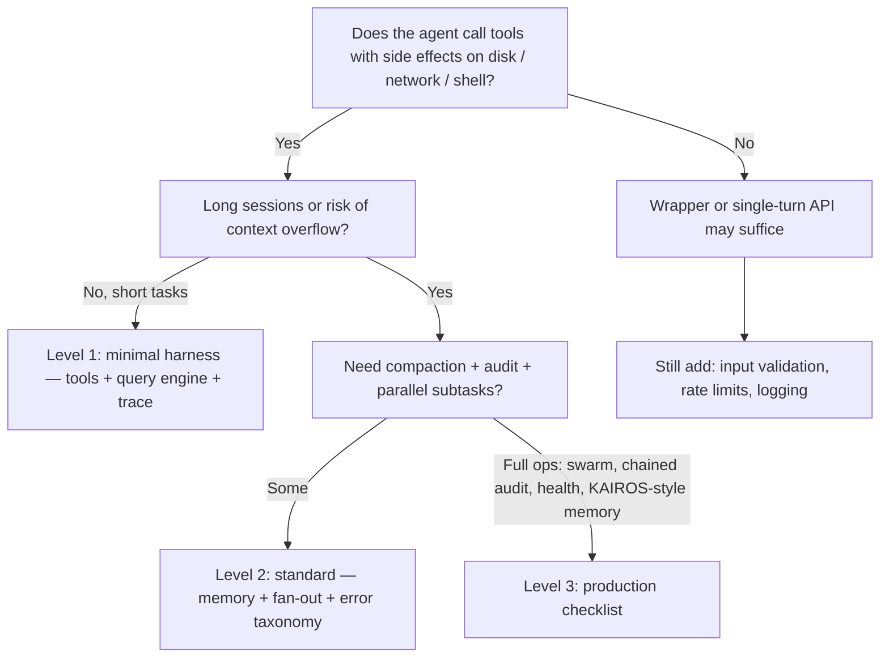

# Decision Tree: Wrapper vs Harness Levels

> **简体中文：** [决策树](zh/decision-tree.md)

Use this to pick how much machinery you need. Aligns with [07-build-guide](07-build-guide.md) checklists.

## Quick rules

| If you need… | Start at… |
|--------------|-----------|
| Only text in / text out, no tools | Wrapper |
| File read/write, grep, bounded shell | Level 1 |
| Session summaries, token budget, parallel dirs | Level 2 |
| Recursive subagents, tamper-evident audit, consolidation into project memory | Level 3 |

## Out of scope for these examples

- **IDE Bridge UI** — protocol only in docs; examples are headless CLI.
- **Hosted multi-tenant** — you still need auth, tenancy, and data isolation on top of this pattern.

When unsure, prototype at **Level 1** and promote concerns to Level 2/3 as you hit real failures (context, cost, concurrency, compliance).
