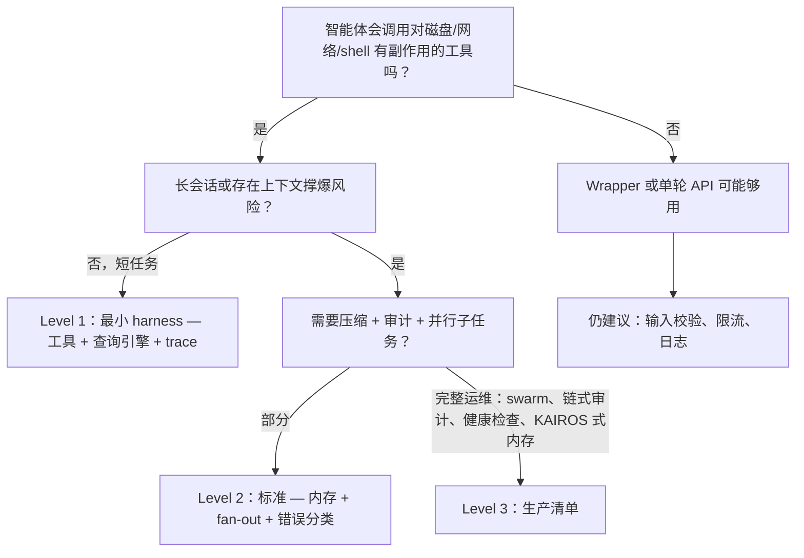

# 决策树：Wrapper vs Harness 各层级

用于选择需要多重的「机械结构」。与 [07-build-guide](07-build-guide.md) 清单一致。

> **English:** [decision-tree.md](../decision-tree.md)

## 快速规则

| 若你需要… | 从…开始 |
|-----------|---------|
| 仅文本进出、无工具 | Wrapper |
| 读/写文件、grep、有界 shell | Level 1 |
| 会话摘要、token 预算、并行目录 | Level 2 |
| 递归子智能体、防篡改审计、合并到项目级记忆 | Level 3 |

## 示例范围外

- **IDE Bridge UI** — 文档仅涉及协议；示例为无头 CLI。  
- **托管多租户** — 仍需在模式之上做认证、租户与数据隔离。

不确定时，先在 **Level 1** 原型，遇到真实失败（上下文、成本、并发、合规）再升级到 2/3。
